# Project Inscryption

Implementation Java du jeu de cartes Inscryption, developpee dans le cadre d'un projet academique.
L'application reproduit fidelement les mecaniques du jeu original dans une interface en ligne de commande :
boucle de jeu en trois parties, systeme de sacrifice, pouvoirs de cartes et adversaire pilote par l'application.


## Regles du jeu

### Objectif

Le jeu se compose de trois parties. Le joueur gagne en remportant les trois parties.
Une partie se termine lorsque l'ecart de score entre le joueur et l'adversaire atteint 5 points dans un sens ou dans l'autre.

### Le plateau

Le plateau contient deux rangees de quatre emplacements. Le joueur pose ses cartes sur la rangee du bas ; l'adversaire occupe la rangee du haut.
La balance situee a gauche represente l'ecart de score actuel.

### Deroulement d'un tour

1. L'adversaire revele les cartes qu'il compte jouer au tour suivant.
2. Le joueur pioche une carte et l'ajoute a sa main.
3. Le joueur peut poser autant de cartes qu'il le souhaite depuis sa main, dans la limite des emplacements disponibles et en respectant les couts de sacrifice.
4. En fin de tour, chacune des cartes du joueur attaque.
  - Si une carte adverse occupe la case en face, elle perd autant de points de vie que la valeur d'attaque.
  - Si la case est vide, le score du joueur augmente de cette valeur.
  - Les cartes volantes attaquent toujours directement le score, quelle que soit la carte adverse en face.
5. L'adversaire joue ensuite son tour de facon symetrique.

## Architecture et diagramme de classes

```mermaid
classDiagram
    direction TB

    namespace engine {
        class Game {
            -NB_DE_PARTIES : int
            -NB_DE_POINTS_POUR_GAGNER_PARTIE : int
            -NB_DE_PARTIES_POUR_GAGNER : int
            -m_joueur : Joueur
            -m_adversaire : Adversaire
            -m_plateau : Plateau
            -m_bApioche : boolean
            -m_finTour : boolean
            +lancerJeu()
            +mettreAJourEtat()
            +mettreAJourPlateau()
            +executerPouvoirCroissance()
            +piochePossible() boolean
            +terminerTour()
            +executerTourJoueur()
            +executerTourAdversaire()
            +preparerJeu()
            +executerPouvoirCoureur()
            +executerPierreDeSacrifice()
            +proposerUneCarte(parmiNombre : int)
        }

        class Entite {
            <<abstract>>
            #m_score : int
            #m_nbOsTotal : int
            #m_nbGouttesDeSangTotal : int
            #m_pioche : Pioche
            #m_main : CarteAnimal[]
            +piocher()
            +getScore() int
            +modifierScore(valeur : int)
            +resetScore()
            +getNbOsTotal() int
            +getNbGouttesDeSang() int
            +getMain() CarteAnimal[]
            +getPioche() Pioche
            +retirerCarteMain(c : CarteAnimal)
            +ajouterCarteMain(c : CarteAnimal)
        }

        class Joueur {
            +placerCarte(c : CarteAnimal, p : Plateau, pos : Position)
            +peutPlacerCarte(c : CarteAnimal, p : Plateau, pos : Position) boolean
            +sacrifier(p : Plateau, pos : Position, c : CarteAnimal)
            +afficherTour(p : Plateau)
            +mettreAJourOs(valeur : int)
        }

        class Adversaire {
            -m_prochaineAction : CarteAnimal[]
            +getProchaineAction() CarteAnimal[]
            +jouerProchain(p : Plateau)
            +executerMeilleur(p : Plateau)
            +mettreAJourStats()
            +reinitialiserProchain()
        }

        class Pioche {
            -NB_MAX_CARTES : int
            -m_pioche : Stack~CarteAnimal~
            +piocher() CarteAnimal
            +nbCartePioche() int
            +viderPioche()
            +afficherPioche()
        }

        class Plateau {
            -NB_CARTES_PAR_LIGNE : int
            -m_plateau : Map~Position, Carte~
            +afficherPlateau()
            +positionnerCarte(p : Position)
            +retirerCarteA(p : Position)
            +reinitialiser()
            +changerCarte(pos : Position, carte : Carte)
            +deplacerCarte(source : Position, dest : Position)
            +placementPossible(pos : Position) boolean
            +estEnnemi(pos : Position) boolean
            +deplacementDroitePossible(pos : Position) boolean
            +deplacementGauchePossible(pos : Position) boolean
        }

        class Input {
            -m_input : String
            +changerInput(newInput : String)
            +tryExecuteInput(j : Joueur, p : Plateau) boolean
        }

        class InputsPossibles {
            <<enumeration>>
            PLACER
            FIN
            PIOCHER
        }

        class Position {
            <<enumeration>>
            A1
            A2
            A3
            A4
            B1
            B2
            B3
            B4
        }
    }

    namespace carte {
        class Carte {
            <<abstract>>
            #m_nom : String
            #m_pv : int
            #m_pouvoir : TypePouvoir
            #m_pouvoirsActifs : TypePouvoir[]
            +attaquer(carteAdverse : Carte) int*
            +estMort() boolean
            +getNom() String
            +getPv() int
            +tuer()
            +detientPouvoir(pv : TypePouvoir) boolean
            +detientPouvoirOriginel(pv : TypePouvoir) boolean
            +activerPouvoir(pv : TypePouvoir)
            +getPouvoirAssocie() TypePouvoir
            +estAnimal() boolean
            +estObstacle() boolean
        }

        class CarteAnimal {
            -m_attaque : int
            -m_gouttesDeSang : int
            -m_os : int
            -m_bVolant : boolean
            +attaquer(carteAdverse : Carte) int
            +modifierPv(valeur : int)
            +getOs() int
            +getGouttesDeSang() int
            +getAttk() int
            +estVolant() boolean
            +impacterAtt(valeur : int)
            +afficherPouvoirs() String
            +estAnimal() boolean
        }

        class CarteObstacle {
            +attaquer(carteAdverse : Carte) int
            +estObstacle() boolean
        }

        class CarteFactory {
            -CarteFactory()
            +creerCarteAnimal(type : TypeAnimal)$ CarteAnimal
            +creerCarteObstacle(type : TypeObstacle)$ CarteObstacle
            +creerCarteAnimalRandom()$ CarteAnimal
            +creerCarteObstacleRandom()$ CarteObstacle
        }

        class TypeAnimal {
            <<enumeration>>
            CHAT
            GRIZZLY
            COYOTE
            MOINEAU
            CORBEAU
            ECUREUIL
            HERMINE
            LOUVETEAU
            LOUP
            PUNAISE
            ELAN
            VIPERE
            PORC_EPIC
        }

        class TypeObstacle {
            <<enumeration>>
            ROCHER
            SAPIN
        }

        class TypePouvoir {
            <<enumeration>>
            NOMBREUSES_VIES
            CROISSANCE
            PUANT
            COUREUR
            CONTACT_MORTEL
            PIQUES_POINTUES
            AUCUN
        }
    }

    class Main {
        +main(args : String[])
    }

    %% Heritage
    Joueur --|> Entite
    Adversaire --|> Entite
    CarteAnimal --|> Carte
    CarteObstacle --|> Carte

    %% Compositions (Game)
    Game "1" *--> "1" Joueur : -m_joueur
    Game "1" *--> "1" Adversaire : -m_adversaire
    Game "1" *--> "1" Plateau : -m_plateau
    Game ..> Input : utilise

    %% Aggregations (Entite)
    Entite "1" o--> "1" Pioche : -m_pioche
    Entite "1" o--> "0..*" CarteAnimal : -m_main

    %% Plateau
    Plateau "1" o--> "0..*" Carte : -m_plateau
    Plateau ..> Position : utilise

    %% Pioche
    Pioche "1" *--> "0..*" CarteAnimal : stocke
    Pioche ..> CarteFactory : utilise

    %% Input
    Input ..> InputsPossibles : utilise

    %% Fabrique
    CarteFactory ..> TypeAnimal : utilise
    CarteFactory ..> TypeObstacle : utilise
    CarteFactory ..> TypePouvoir : utilise
    CarteFactory ..> CarteAnimal : instancie
    CarteFactory ..> CarteObstacle : instancie

    %% Carte
    Carte ..> TypePouvoir : utilise

    %% Point d'entree
    Main ..> Game : appelle
```



## Structure du depot

```
project-inscryption/
├── README.md
├── .gitignore
├── deps/
│   ├── hamcrest-core-1.3.jar
│   └── junit-4.13.1.jar
├── out/
│   └── .gitkeep
├── src/
│   ├── Main.java
│   └── inscryption/
│       ├── engine/        # Boucle de jeu, joueur, adversaire, plateau, saisie
│       └── carte/         # Modele de cartes, types, pouvoirs, fabrique
├── tests/
└── uml/
    ├── semaine1.puml
    ├── semaine2.puml
    ├── semaine3.puml
    ├── semaine4.puml
    └── semaine5.puml
```

---

## Prerequis

- **Java SDK 25** dans IntelliJ IDEA. Certaines fonctionnalites peuvent ne pas fonctionner avec d'autres versions ou d'autres IDE.
- JUnit 4.13.1 et Hamcrest Core 1.3 sont fournis dans le repertoire `deps/` et ne necessitent pas d'installation separee.

---

## Lancement

1. Ouvrir le projet dans IntelliJ IDEA avec le SDK Java 25.
2. Compiler les sources du repertoire `src/` vers `out/`.
3. Ajouter `deps/junit-4.13.1.jar` et `deps/hamcrest-core-1.3.jar` au classpath pour executer les tests.
4. Lancer `Main.java` pour demarrer le jeu.

---
